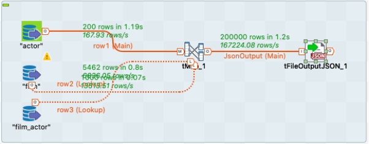

### Master en Data Analytics para la Empresa

#### Asignatura tratamiento integral del dato

- Alumno:  [Fco de Borja Ponz](https://github.com/fbponz)
- Docente: [Pedro Nieto](https://github.com/a10pepo)

#### Enunciado entrega 1, Talend:

##### Ejercicio 1) Debéis leer un fichero CSV y escribirlo a fichero Json en la misma carpeta

Esquema de componentes utilizados para la realización del ejercicio.

Configuración de componente para importación de datos desde fichero CSV.

configuración del componente de exportación hacia fichero JSON.

##### Ejercicio 2) Debéis leer un fichero CSV y reemplazar: MALE-> M y FEMALE-> F

Esquema de componentes utilizados para la realización del ejercicio.

Configuración de componente para importación de datos desde fichero CSV.

Configuración del componente tReplace

Configuración para exportar a fichero json

##### Ejercicio 3)Leer tabla de actores y volcarlo a fichero JSON

Esquema de módulos utilizados para la realización del ejercicio.

Configuración del componente, que realiza la conexión entre la base de datos y Talend, en este caso tabla Actor.

Configuración para exportar a fichero json

##### Ejercicio 4) Agregar las películas por rating y mostrar un count, volcar a json el resultado

Esquema de módulos utilizados para la realización del ejercicio

Configuración del componente, que realiza la conexión entre la base de datos y Talend, en este caso tabla film.

Configuración componente que se encarga de generar la información que queremos por un lado devolver el rating de la película y por otro la operación de contar el total de películas con una rating concreto

Configuración para exportar a fichero json

##### Ejercicio 5) Realizar un Join entre Actor / Film / Film_Actor y volcar a json un fichero con estos campos: Nombre, Apellido y Película

Esquema de módulos utilizados para la realización del ejercicio

Configuración del componente, que realiza la conexión entre la base de datos y Talend, en este caso tabla actor

Configuración del componente, que realiza la conexión entre la base de datos y Talend, en este caso tabla film

Configuración del componente, que realiza la conexión entre la base de datos y Talend, en este caso tabla film_actor

La configuración de t_map

Configuración para exportar a fichero json

##### Ejercicio 6) Cargar una tabla con la cantidad de dinero Gastada por usuario, nombre y apellido: 

Esquema de módulos utilizados para la realización del ejercicio

Configuración del componente, que realiza la conexión entre la base de datos y Talend, en este caso tabla customer

Configuración del componente, que realiza la conexión entre la base de datos y Talend, en este caso tabla payment

La configuración de t_map

El componente agreggate_row

Configuración del componente, que realiza la conexión entre la base de datos y Talend, en este caso tabla Expenditures

Este ejercicio lo he resuelto también escribiendo directamente en la base datos

##### Ejercicio 7) Cargar una tabla con el numero de veces que se ha alquilado cada película, solo con aquellas que han sido alquiladas al menos una vez

Esquema de módulos utilizados para la realización del ejercicio

Configuración del componente, que realiza la conexión entre la base de datos y Talend, en este caso tabla rental

Configuración del componente, que realiza la conexión entre la base de datos y Talend, en este caso tabla film

Configuración del componente, que realiza la conexión entre la base de datos y Talend, en este caso tabla inventory

La configuración de t_map

En el componente aggregateRow,  vamos a calcular el numero de veces que hemos alquilado una película

##### Ejercicio 8) Leer de Big Query de la tabla alumnos filtrando los que contengan un nombre en concreto

Esquema de módulos utilizados para la realización del ejercicio

Para conectar con Big-query vamos a utilizar una clave de Service Account

Como la query que hacemos a Big-query es 

#### Enunciado entrega 1, SQL:

##### 1. Proporciona una SQL que muestre los siguientes datos: Nombre Actor y Apellido Actor Query: 

    SELECT first_name, last_name 
    FROM public.actor

##### 2. Proporciona una SQL que muestre los siguientes datos: Nombre Actor y Titulo de la Película Query: 

        SELECT actor.first_name, film.title 
        FROM actor 
        JOIN film_actor ON actor.actor_id = film_actor.actor_id 
        JOIN film ON film_actor.film_id = film.film_id;

##### 3. Proporciona una SQL que muestre los siguientes datos: Nombre Actor, Número de películas, Ordenar de mayor a menor Query: 

        SELECT actor.first_name, COUNT(actor.first_name) 
        FROM actor JOIN film_actor ON actor.actor_id = film_actor.actor_id JOIN film ON film_actor.film_id = film.film_id 
        GROUP BY actor.first_name
        ORDER BY 2 DESC;

##### 4. Proporciona una SQL que muestre los siguientes datos: Película y Numero de veces alquilada Query: 

    SELECT film.title, COUNT(rental.rental_id) 
    FROM film 
    JOIN inventory ON film.film_id = inventory.film_id 
    JOIN rental ON inventory.inventory_id = rental.inventory_id 
    GROUP BY film.title
    ORDER BY 2 DESC;

##### 5. Proporciona una SQL que muestre los siguientes datos: Película y Dinero recaudado por película Query: 

    SELECT film.title, SUM(payment.amount) 
    FROM film 
    JOIN inventory ON film.film_id = inventory.film_id 
    JOIN rental ON inventory.inventory_id = rental.inventory_id 
    JOIN payment on rental.rental_id = payment.rental_id
    GROUP BY film.title
    ORDER BY 2 DESC;

##### 6. Proporciona una SQL que muestre los siguientes datos: Nombre del mejor cliente (mayor gasto) Query: 

    SELECT customer.first_name,
      SUM(payment.amount) AS total
    FROM customer
    JOIN payment ON customer.customer_id = payment.customer_id
    GROUP BY customer.first_name
    ORDER BY total DESC
    LIMIT 1;

##### 7. Proporciona una SQL que muestre los siguientes datos: Nombre del mejor cliente (mayor num alquileres) Query: 

    SELECT customer.first_name, COUNT(payment.amount) AS total
    FROM customer
    JOIN payment ON customer.customer_id = payment.customer_id
    GROUP BY customer.first_name
    ORDER BY total DESC
    LIMIT 1;
